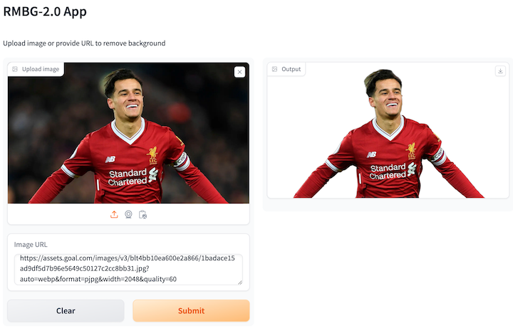
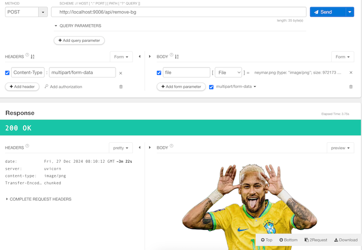

# RMBG2-docker

## Introduction

Quickly run a web interface and API service based on the [RMBG-2.0](https://huggingface.co/briaai/RMBG-2.0) model.

## Prerequisites

###  Download RMBG-2.0 model weight files

```
huggingface-cli download --resume-download briaai/RMBG-2.0 --local-dir RMBG-2.0
```

### Clone this repository

```
git clone https://github.com/Valdanitooooo/RMBG2-docker.git
```


## Running with Docker 

Rename `.env_example` to `.env` and change the value of `MODEL_DIR` to the correct model weight directory.

You can use the [image](https://hub.docker.com/r/valdanito/rmbg2_app_base) I have already published to Dockerhub 

### Running on GPU machine

```
docker-compose up -d
```

### Running on CPU machine

```
docker-compose -f docker-compose-cpu.yml up -d
```

## Running without Docker

Modify `/models/RMBG-2.0` in the `main.py` file to point to the correct model weight path.

```
conda create -n rmbg2 python=3.10 && conda activate rmbg2
pip install -r requirements.txt
python app/main.py
```

## Usage

### Web App

Upload image or provide URL to remove background



### API

- Request method: POST
- URL: http://localhost:9006/api/remove-bg
- Request body: Contains a form data named file

